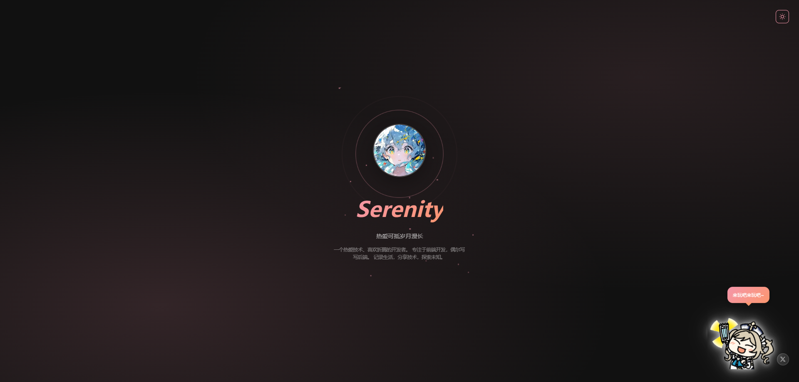
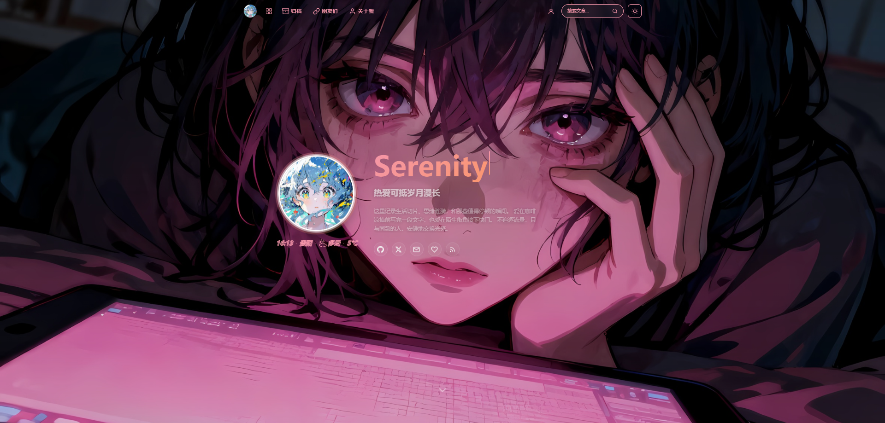
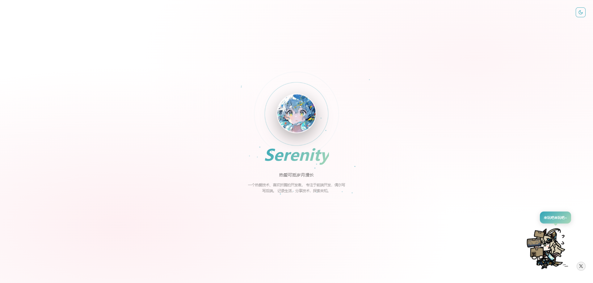
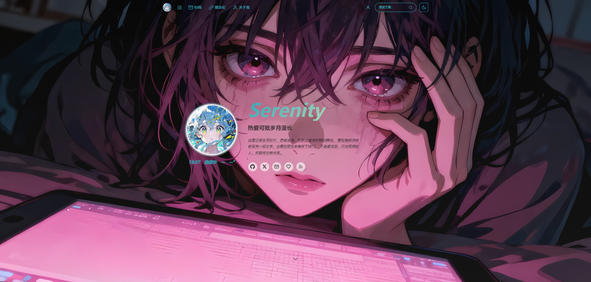
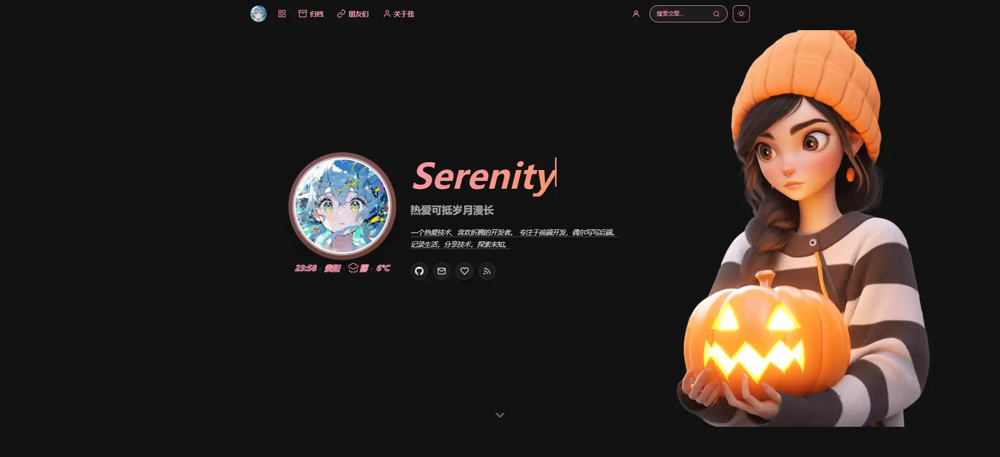
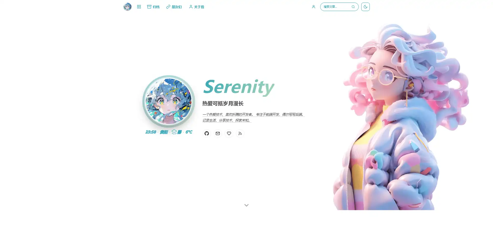

  

<h1 align="center">Serenity-Grace</h1>

  简约优雅的 Halo 2.x 博客主题，以樱花粉与湖水蓝为主色调，支持亮暗模式自由切换。

  
  
  

  <a href="https://serenity.aobp.cn/">在线演示</a> · 
  <a href="#页面模板">页面一览</a> · 
  <a href="#页面配置">页面配置</a> · 
  <a href="https://github.com/atangccc/Serenity-Grace/releases">更新日志</a>

---

## 预览

| 暗色模式 | 亮色模式 |
|:---:|:---:|
|  |  |
|  |  |
|  |  |

## 特性

### 设计

- 暗色 / 亮色双模式，支持跟随系统偏好，主题切换带圆形扩散动画（View Transition API）
- 响应式布局，桌面端、平板、手机全面适配，移动端各页面独立优化
- Lenis 丝滑滚动，全局惯性缓动，锚点跳转和返回顶部均为平滑滚动
- AOS 滚动入场动画，元素随滚动渐入视野
- 首次访问全屏欢迎页，可配置吉祥物形象和自定义语录
- 页面切换过渡动画，跳转时带淡入淡出效果

### 页面模板

| 模板 | 说明 |
|------|------|
| **首页** | Hero 区域（头像、打字机标题、背景壁纸）+ 风向标导航 + 近期笔记 + 站点动态 + 随想碎片轮播 + 生活回想滑块 + 天气时钟 |
| **文章详情** | 封面 Hero + 浮动目录导航 + 阅读进度条 + 相关文章推荐 + 版权声明 + 分享（微信/微博/QQ/复制链接） |
| **归档** | 文章卡片列表 + 侧边栏（一言、热门文章、最新评论、标签云）+ 置顶文章标识 + 分页 |
| **标签** | 数据面板（圆环统计图 + 柱状图）+ 标签胶囊墙，hover 联动高亮，颜色读取后台配置 |
| **分类** | 卡片网格展示，每个分类显示图标和文章数 |
| **关于** | 个人信息 + 技能进度条 + 建站历程时间线 + 十年之约倒计时 + 联系方式 |
| **碎碎念** | 适配官方瞬间插件，时间线布局，支持图片灯箱 |
| **朋友们** | 友链卡片 + 友链申请（适配友链自助提交插件）+ 信息一键复制 |
| **留言板** | 弹幕式留言展示 + 评论组件 |
| **项目集** | GitHub 项目卡片，区分"我的项目"和"收藏项目"，我的项目支持版本详情弹窗（自动拉取 Releases） |
| **朋友圈** | 订阅友链文章聚合展示 |
| **图库** | 照片瀑布流 + 内置灯箱 |
| **登录 / 注册** | 自定义登录注册页面，与主题风格统一 |

### 后台配置

主题提供完善的后台设置面板，所有内容均可在 Halo Console 中配置：

- **基本设置** — 站点标题、作者、描述、Logo、Favicon、默认主题模式、自定义 Head/Script 代码注入
- **首页头部** — 头像、名称、标语、个人简介、打字机文字、背景壁纸（图片/视频）
- **欢迎页** — 启用开关、吉祥物图片（暗色/亮色各一张）、自定义语录、来源链接
- **社交链接** — GitHub、Twitter/X、Email、微博、B站、知乎等，支持自定义图标
- **风向标** — 首页快速导航区域，可配置图标和链接
- **天气时钟** — 集成心知天气 API，显示实时天气和时间
- **侧边栏** — 一言 API、热门文章数量、最新评论数量、标签云开关
- **文章页面** — 版权信息、分享按钮、侧边栏组件配置
- **关于页面** — 技能列表、建站历程、十年之约目标日期
- **项目展示** — GitHub Token 配置、项目归属类型（我的/收藏）
- **页脚** — 备案号（ICP/公安）、建站年份、RSS 订阅、自定义链接
- **SEO** — 关键词、JSON-LD 结构化数据、站点验证码
- **水印** — 全局水印文字配置

### 插件适配

| 插件 | 用途 | 必需 |
|------|------|:----:|
| [评论组件](https://www.halo.run/store/apps/app-YXyaD) | 文章评论、留言板评论 | ✅ |
| [瞬间](https://www.halo.run/store/apps/app-SnwWD) | 碎碎念页面数据源 | ✅ |
| [链接管理](https://www.halo.run/store/apps/app-hfbQg) | 友链页面数据源 | ✅ |
| [图库管理](https://halo.run/store/apps/app-BmQJW) | 图库页面数据源 | ✅ |
| [友链自助提交](https://www.halo.run/store/apps/app-hfbQg) | 友链申请功能 | 推荐 |
| [朋友圈](https://docs.kunkunyu.com/docs/plugin-friends) | 朋友圈聚合页面 | 推荐 |
| [爱发电](https://blog.xindu.site/docs/plugin-afdian) | 关于页面赞助展示 | 可选 |
| [Dicebear 头像](https://github.com/YunJian101/Halo-Plugin-Dicebear-Avatar) | 评论随机头像 | 可选 |
| [LightGallery 灯箱](https://www.halo.run/store/apps) | 文章图片灯箱（未安装时使用内置灯箱） | 可选 |

> 所有插件均可在 [Halo 应用市场](https://www.halo.run/store/apps) 中安装。

---

## 页面配置

安装主题后，需要在 Halo 后台创建自定义页面并选择对应模板：

| 页面 | 模板选择 | 建议别名 |
|------|----------|----------|
| 关于我 | `about.html` | `about` |
| 碎碎念 | `moments.html` | `moments` |
| 朋友们 | `links.html` | `links` |
| 留言板 | `guestbook.html` | `guestbook` |
| 项目集 | `projects.html` | `projects` |
| 朋友圈 | `friends-circle.html` | `friends-circle` |
| 图库 | `photos.html` | `photos` |

> 归档（`/archives`）、标签（`/tags`）、分类（`/categories`）为 Halo 内置路由，无需手动创建页面。

1. 在 Halo 后台「页面」中新建页面
2. 在页面设置中选择对应的「自定义模板」
3. 设置页面别名（slug）为上表中的访问路径
4. 发布页面后即可通过对应路径访问

---

## License

[GPL-3.0](LICENSE) © Serenity
